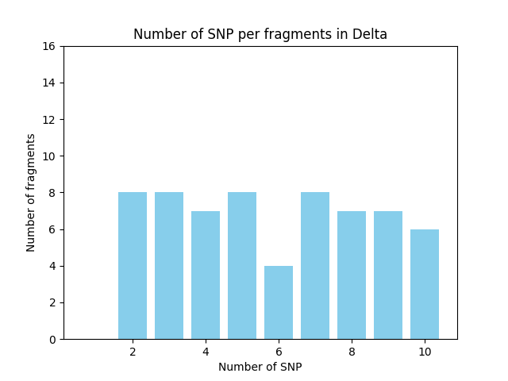
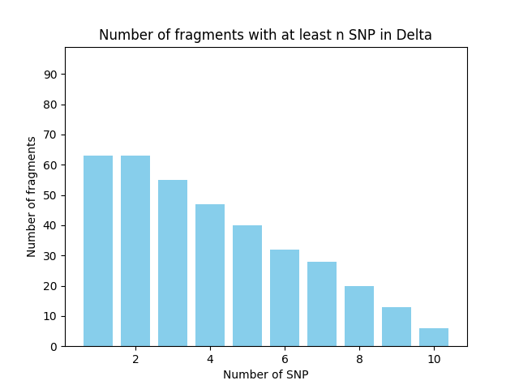
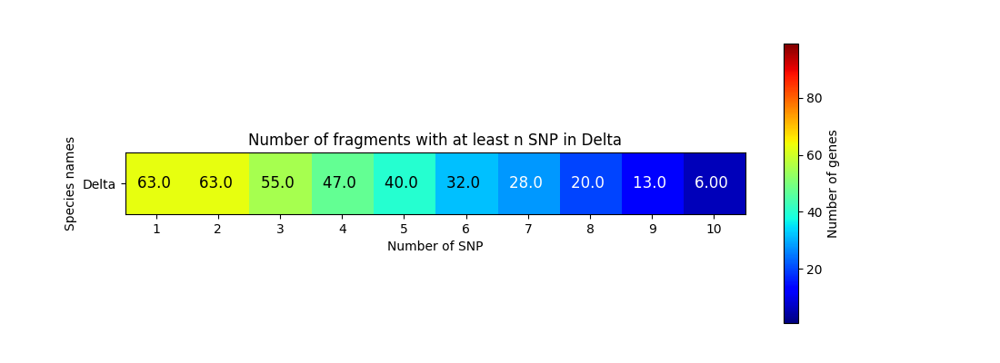
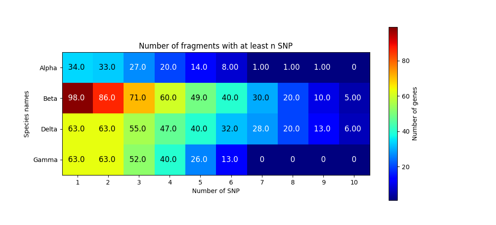

# Snp HeatMap
The goal of this project is to create a number of chart 
related to snp (simple nucleotide polymorphism) analysis

Those charts are : 
- [Quantitative chart](#quantitative-chart-) (-q) : Show the number of gene (y) per number of snp (x)
- [Cumulative chart](#cumulative-chart-) (-c) : Show the number of gene (y) that have at least n snp (x)
- [Cumulative chart](#cumulative-chart-) (-u) : Cumulative bar chart but it's a heatmap
- [Global Heatmap](#global-heatmap-) (-g) : concatenation of all Cumulative chart

## Installation :
- Download
  1. Download Repository ("<> Code" button top right --> "Download zip")
  2. Unzip the Downloaded files

- Using linux terminal
  1. `git clone https://github.com/F-Marchal/SnpHeatMap.git`
  2. `cd SnpHeatMap`

see [Quick usage](#quick-usage-) and [Quick usage](#complete-usage-) in order to run main.py

## File format :
Files used by this script are expected to have the following pattern :

| Gene name / id | Other       | Snp counter |
|----------------|-------------|-------------|
| Gene1          | Other info1 | x           |
| Gene2          | Other info2 | y           |

- All files have to have the same headers 
- When a gene is present multiple times, only the last occurrence is used
- Snp counter should be integer greater or equal to 0. No dot ('.') or comma (',') are allowed in this cell.

##### Path to your files
By default, the program assumes that all your files are in the `Data/` folder.

Path toward your files can be give using two methods :
- Using folder path
  - All files inside the folder are used.
  - Names in the graph are file's names
  - Files that start with "." are ignored.
  - Is the default option

- Using a json's path
  - This file should have the following format `{path_to_a_file: common_name}`. You can open `test/TargetedFiles.json` if you need an example
  - Names in the graph are `common_name`
  - If multiple path have the same `common_name` they will be considered as the same file.

All files represent a species or a group of related individuals.

Can also be provided using parameters see [path](#--path-or--p)

## Usage :
Please read [File format](#file-format-) before using main.py and [Path to your files.](#path-to-your-files)

### Quick usage :
- Put your files inside the `data` folder
- Open a terminal in this folder or use `cd` to change terminal's current directory
- In Linux :
  - run `python3 main.py [Gene name Column] [Snp column]`
- If you use windows :
  - run `python3 main.py [Gene name Column] [Snp column]`
  
### Complete usage :
- linux : `python3 main.py [Gene name Column] [Snp column] [Path to your files] [Options]`
- Windows : `python3 main.py [Gene name Column] [Snp column] [Path to your files] [Options]`
This command will make a "global heatmap" for all your files in data
#### Arguments
- **Warning:** Arguments should always be before the parameters

##### Gene name Column (First argument)
Name of the column that contain gene's names / ids in files. e.g. "Gene name / id" in [File format](#file-format-)

Can also be provided using parameters see [name_column](#--name_column-or--n)

##### Snp column (Second argument)
Name of the column that contain snp in files. e.g. "Snp counter" in [File format](#file-format-)

Can also be provided using parameters see [snp_column](#--snp_column-or--s)

##### File path (Third argument)
See [Path to your files](#path-to-your-files)

Can also be provided using parameters See [path](#--path-or--p)

#### Parameters
**Warning:** Parameters should always be afters the arguments 

##### `--name_column` or `-n`
This parameter must be followed by a string. 
See [gene name Column](#gene-name-column)

##### `--snp_column` or `-s`
This parameter must be followed by a string. 
See [snp column](#snp-column)

##### `--path` or `-p`
This parameter must be followed by a string that represent a path.
See [path to your files](#path-to-your-files)

##### `--output_path` or `-o`
This parameter must be followed by a string that represent a path.
This parameter modify where charts and tsv are saved. 

Default = `./output`

##### `--job_name` or `-j`
This parameter must be followed by a string that can be used as folder name.
This added a prefix to all files generated by this script.

Default = "Unnamed"

##### `--max_length` or `-m`
This parameter must be followed by an integer. If this inger is lower than 0, max_length is ignored.
Limit the number of snp shown inside each graph.

Default = 20

##### `--help` or  `-h`
Display a help message.

Others parameters are ignored.

##### `--output_warning` or `-w`
Disable the warning when you are about to generate files inside a non-empty folder.

##### `--sort_by_name` or `-r`
Disable sort species by names in global heatmap.

##### `--simplified` or  `-i`
Ignore snp number represented by 0 genes. THIS MAY CREATE A DISCONTINUOUS X-AXIS

##### `--global_heatmap` or `-g`
Generate a heatmap that represent all species.

##### `--quantitative_barchart` or `-q`
Generate a barchart that represent snp distribution for each file (Number of gene that have n snp)

##### `--cumulative_barchart` or `-c`
Generate a barchart that represent snp distribution for each file (Number of gene that **at least** n snp)

##### `--cumulative_heatmap` or `-u`
Generate a heatmap for each file. This heatmap contain only one line.

##### `--tsv` or `-t`
Generate a tsv for all generated charts.

##### `--png` or `-k`
Generate a png for all generated charts.

##### `--show` or `-d`
Show all generated charts during the execution. ALL CHARTS WILL STOP THE EXECUTION UNTIL IT IS CLOSED.

##### `--svg` or `-v`
Generate a svg for all generated charts.

##### `--show_values` or `-e`
An integer (positive or negative)

If greater or equal to 0, all heatmap's cells will contain theirs values. if lower than 0,
text size in cell is automatically determined 
(can be ugly in the windows displayed by -d, but assure that the text is well sized in 
png and svg). If unspecified, cells are empty.

##### `--uniform_y` or `-y`
Uniformize all y-axis. All Quantitative chart and all Cumulative chart 
will  have the same upper limit and the same scale on their y-axis.
(Quantitative and Cumulative charts still have disjoint y-axis)

##### `--transparent`
Charts are exported with a transparent background.

## Example chart
Charts generated using `python3 Contig_name BiAllelic_SNP tests/TargetedFiles.json -m 10 -kgqcuw -j Examples --show_values -1`

The data used in these graphs comes from a random generator

### Quantitative chart :
A barchart that show the proportion of gene that have a certain number of snp.

### Cumulative chart :
A barchart that show the proportion of gene that have at least certain number of snp

### Cumulative Heatmap :
A heatmap that show the proportion of gene that have at least certain number of snp (variation of Cumulative chart)

### Global Heatmap :
A heatmap that show the proportion of gene that have at least certain number of snp for all species.
  

# NOTE FOR LATER
Since the 1.1.0, the parameter `--name_column` is almost useless. The code should be reworked to 
remove any usage of this option. 